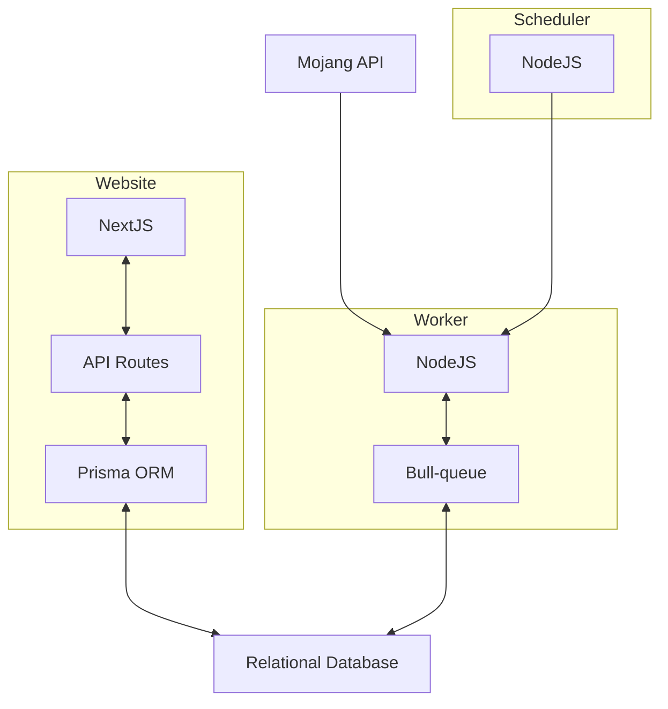

## Welcome to Minecraftblocked! 🛠️
Committed to transparency within the Minecraft community, particularly regarding Mojang's enforcement of the End User License Agreement (EULA). This project aims to shed light on the increasing number of Minecraft servers being banned due to EULA violations, and to provide clarity on what these servers are.

This can be tricky as Mojang does not reveal the actual IP address or hostname for the server but only a hash. To tackle this challenge, we maintain a database of all known public Minecraft servers and match these hashes to them. 

## The goal 🚀
The aim is to shed light on the increasing number of Minecraft servers being banned due to EULA violations and to provide clarity on what these servers are. We are dedicated to providing this information in an accessible and user-friendly manner.

## Tech Stack 🧰

We use the latest tech such as:
- Express.js
- Next.js
- Prisma
- TypeScript

## Inspiration and Acknowledgements 🎨

This project was inspired by [@Blocked Servers on Twitter](link-to-blocked-servers-twitter) - we're big fans and even integrated parts of their service into our website for an improved user experience.

## Support Us 💪

We love hearing from the community! If you have any feedback, suggestions, or want to chat about Minecraft, don't hesitate to reach out.

## System inner workings

Below is a diagram showcasing how various components of our system interact:

